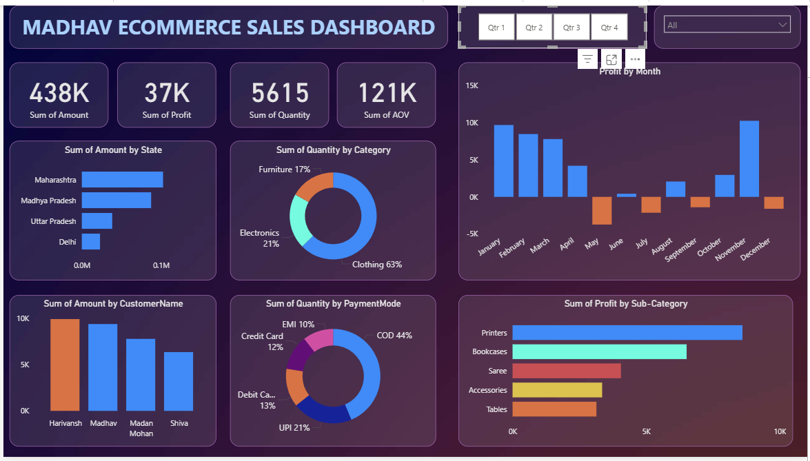

# 📊 Madhav Ecommerce Sales Dashboard

## 🧾 Project Overview  
This project presents an **interactive Ecommerce Sales Dashboard** that analyzes sales performance, customer behavior, payment modes, and profitability across multiple dimensions. It helps in making **data-driven business decisions**.

---

## 🚀 Key Metrics

| Metric | Value |
|-------|-------|
| **Total Sales Amount** | 438K |
| **Total Profit** | 37K |
| **Total Quantity Sold** | 5615 |
| **Average Order Value (AOV)** | 121K |

---

## 📌 Dashboard Insights

### 🔹 State-wise Sales
- **Maharashtra** has the highest sales.
- Madhya Pradesh and Uttar Pradesh follow behind.

### 🔹 Category-wise Quantity Distribution
- **Clothing** contributes **63%** of total quantity sold.
- Electronics (21%) and Furniture (17%) follow.

### 🔹 Monthly Profit Trend
- **Best Months:** January & December  
- **Loss-Making Months:** June & July

### 🔹 Top Customers
- **Harivansh** and **Madhav** are the highest spending customers.

### 🔹 Payment Mode Breakdown
- **COD** is the most used payment method (44%).
- UPI and Debit Cards also show significant usage.

### 🔹 Sub-Category Profit
- **Printers** generated the highest profit.
- Bookcases and Sarees also performed well.

---

## 📷 Dashboard Preview  
Include this image in your repo:

**Amit Kumar**
amitjnv1268@gmail.com

```md

